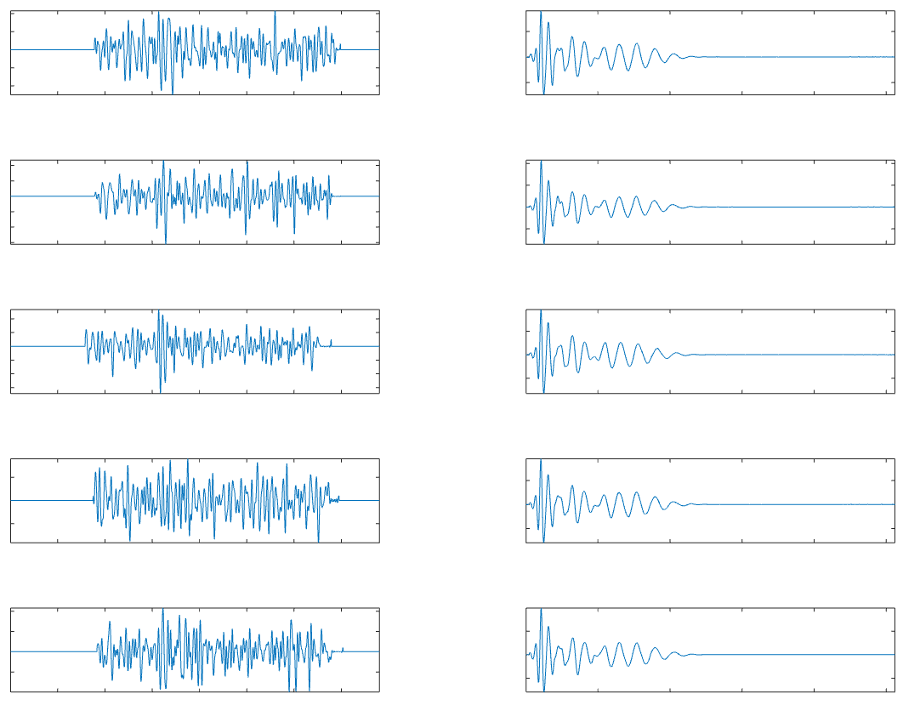
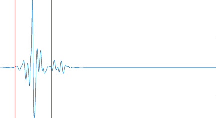
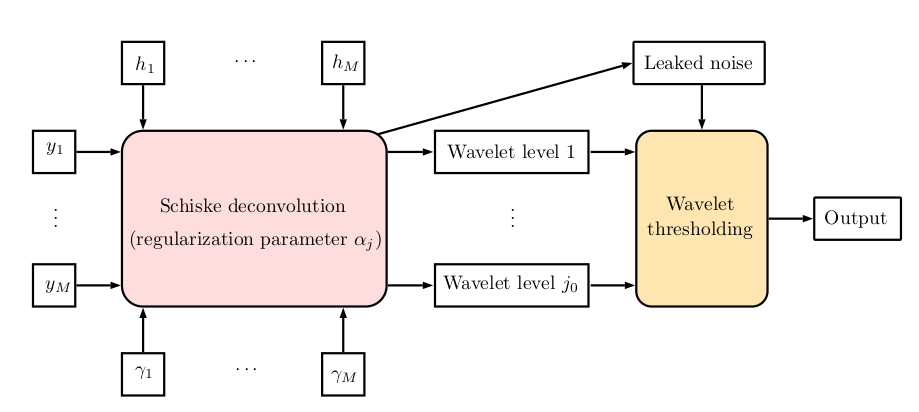

# Deconvolution

Wavelet and Fourier-based multichannel deconvolution.

Estimates an unknown 1-dimensional vector from observation that is obtained by convolving with (or, blurred by) a known vector (called the *impulse response*) and then by adding a white noise. The estimate is more accurate when more than one observation are available, in which case the estimation problem is called a *multichannel deconvolution* problem. The estimation is done by solving a regularized minimization problem.

This project contains
- multichannel deconvolution algorithms: Fourier-based mean Weiner, Fourier-wavelet multichannel hybrid Schiske-ForWaRD
- single-channel (usual) deconvolution algorithms: Fourier-based Weiner deconvolution, hybrid (Fourier-wavelet) ForWaRD algorithm (Neelamani-Baranuik-Choi)
- various Fourier and wavelet analysis and visualization tools in 1 dimension

# Demonstration

Consider the following observations (left) of an unknown source signal made by 5 antennas and their corresponding known impulse responses (right).


The estimated unknown signal using Schiske ForWaRD method (`rho=2`) (see below) is:


```
[w, ratiounthres, thrvec]  = schiskeforwd(faxobs, faximp, fori, B, p, noiseax, scaling, rho, method)
```


# Requirements

GNU Octave or Matlab

# Usage

### Wavelet related functions:
* `[u, v] = filt(type, p)` returns the parent wavelets `u`, `v` used in wavelet transform used of type `type`.
* `w = wtrans(z, type, p)` returns the `p`th resolution wavelet transform of the vector `z` using the parent wavelets of type `type`.
* `z = iwtrans(w, type, p)` returns the `p`th resolution _inverse_ wavelet transform of the vector `w` using the parent wavelets of type `type`. If the `type` and `p` are the same, `iwtrans` and `wtrans` should be inverses of each other upto some _small_ error.
* `coeffs(w, p, q)` returns the `q`-th level wavelet coefficients of the `p`-th resolution wavelet transform. `q` can be from `1` to `p+1`. q=p+1 represents the coarsest wavelet level.
* `B = getbasismat(type, p, N)` generates a matrix of dimension `(p+1)xN` whose j-th row contains the basis element which is translated to generate the vectors used to compute the j-th level wavelet coefficients of a `p`-th resolution wavelet transform of a signal of length `N` (an integer power of 2).
* `[w, ratiounthres, wnoise] = applythres(w, method, p, thrvec)` applies a thresholding on a given wavelet transform `w` using `method` as `hard`, `soft`, or `wien`, when a vector `thrvec` of length `p`+1 is supplied that contains the noise standard deviation of each level

### Parameters:
* `type` can be `shan` for Shannon's wavelets, `d`n for Daubechies wavelets where n can be `2`, `4`, ... , `20`.
* If `type`= `shan`, `p` must divide the length of the signal `z` or `w`.

### Helper functions for wavelet related tools (codes are self-explanatory):
* `filt(type, N)` contains the parent wavelets of various wavelet bases. `N` should be an integer power of 2.
* `v = getother(u)`: given one parent wavelet `u`, returns the other `v` using the conjugate mirror filter lemma.
* `wrec`, `iwrec` are recursive implementation of wavelet transform and inverse wavelet transforms, also called Fast Wavelet Transform. Works best (fastest) on vectors of length of type 2^n for some natural number n.
* `up`, `down` upsamples and downsamples a signal by zeros.
* `fold(z)` folds a vector in half.
* `realconv(a,b)` is the circular convolution of two real  signals (i.e. it returns the real part of the inverse Fourier transform of the product of Fourier transforms of the participating signals)
* `sigmal = getleakedsd(B, L, r, noiseax, scaling)` computes the leaked noise s.d., given `L` and `r` (see `fdecschiske.m`) related to the impulse responses and the wavelet basis matrix `B` (see `getbasismat()`)

### Plotting tools:
* `plotcoeffs(w,p)` plots the coefficients of wavelet transform `w`, the `p`-th resolution wavelet transform
* `plotbasis(type, p, N)` (better) plots the basis elements by first computing the full basis matrix using `getbaismat`

### Wavelet compression
Wavelet transform can also be used for compression (if the data is sparse enough)
* `keeplarge` zeros out smaller values of wavelet coefficients
* `w = compress(z, type, p, K)` returns  compressed vector `w` from original vector `v`
* `relerr(z, typelist, kMax, p, q)` returns the relative error matrix computed in `q`-norm
<!-- * `compareErr(z, typelist, kMax, p, normlist)` -->


### Fourier based Deconvolution
* `[fw, mult] = fdecwien(fsig, fimp, fori, noise, scaling)` returns the Fourier transform `fw` of the Wiener deconvolution with the (usually unknown) signal`mult` returns the Fourier shrinkage parameter used in the deconvolution.
```
 Input: 	fobs: Fourier transform of the noisy observed signal
		fimp: Fourier transform of the impulse response	
		fori: Fourier transform of the guess for the original signal
 			A possible guess will be fobs./sqrt(var(fimp))
		noise: a scalar for noise standard deviation, or the noise data (time domain)
		scaling: A regularized parameter to reduce the ringing, default =1
 Output:	fw:	Fourier transform of the estimate
		mult:	Fourier shrinkage multiplier
```

* `[fw, mult] = fdecschiske(faxobs, faximp, fori, noiseax, scaling)` returns the Fourier transform of the Schiske deconvolution applied to a set of observations.

```
 Schiske deconvolution in the frequency domain
 Input: 	faxobs: Fourier transform of the noisy observed signal matrix
		faximp: Fourier transform of the impulse response matrix
		fori: Fourier transform of the guess for the original signal
 			A possible guess will be fobs./sqrt(var(fimp))
		noiseax: a row vector containing scalars for noise standard deviation, or the noise data matrix (time domain)
		scaling: A regularized parameter to reduce the ringing, default =1
 Output:	fw:	Fourier transform of the estimate
		mult:	Fourier shrinkage multiplier matrix
```

### Wavelet based deconvolution
* `[w, ratiounthres, thrvec]  = wienforwd(fsig, fimp, fori, B, p, sigma, scaling, rho, method)` estimates the wavelet coefficients using the ForWaRD algorithm
After doing deconvolution in Fourier then wavelet domain, based on supplied scaling values
    ```
      B: is the wavelet basis constructed using getbasis()
  sigma: is the standard deviation used in wiener deconvolution
scaling: should be of length p+1
    rho: extra parameter vector to control the thresholding, default should be 1
 method: hard, soft, or wien
    ```
*  `[w, ratiounthres, thrvec]  = schiskeforwd(faxobs, faximp, fori, B, p, noiseax, scaling, rho, method)` performs the multichannal deconvolution using Schiske and ForWaRd algorithm
```
scaling should be of length p+1
   type is the wavelet filter type, p-th stage
      B is the wavelet basis constructed using getbasis()
noiseax is scalar, constant noise sd across all channels
```
The schematics of the algorithm is given below.


* `[w, ratiounthres, thrvec]  = schiskeforwd_alt(faxobs, faximp, fori, B, type, p, noiseax, scaling, rho, method)`

* `alpha = getoptsc(z, K, type, p, sigma, rootmethod)` compute the optimal  scaling parameter vector `alpha` of length `p+1` that minimizes the error in ForWaRD algorithm. Here `rootmethod` can be either `search` (for searching through uniformly located numbers between 0 and 1) or `bisec` (for a bisection method, much faster and accurate)

### Data
A sample data is included to play with. The data is collected by the [ANITA](https://en.wikipedia.org/wiki/Antarctic_Impulsive_Transient_Antenna) project using an array-antenna carried by a balloon in Antarctica. It is a time-series data of electromagnetic activities captured by 15 antennas facing the source of the signal.

* `getantenna(n)` outputs the filename of the impulse response of the antenna, given the absolute index of the antenna
* `[ax, aximp] = prepsig(num)` outputs matrix `ax` with noisy blurred ANITA signals and `aximp` contains the impulse responses used in the observation
* `[snrval, M, m, a, b] = getsnr(z)` computes the signal-to-noise ratio of a temporally localized signal `z`. Here, `M` and `m` are the max and the min of the signal, the time interval `[a,b]` has 10 times the length of the peak region and is a neighborhood of the peak region.
<!--* `wpxsc = getwpxsc(type, p, sigma)` returns the optimal scaling values `alpha` required for the deconvolving the ANITA signal `wpx` (see `getdata` for the test signal), using the bisection method -->

* `plotfanita(z)` plots the absolute value of the Fourier transform of an ANITA signal in the frequency domain in MHz unit
* `plotfanitaS(z)` (with a different sample rate) plots the absolute value of the Fourier transform of an ANITA signal in the frequency domain in MHz unit

### Other tools
* `z = padfreq(w, N, eps)` increases the resolution of the signal (i.e. upsamples) `w` by zero-padding followed by smoothing. If `N > length(w)` it adds zeros in the frequency domain. However, the process can add Gibbs phenomenon in the time domain if the frequency does not decay to zero. To avoid this, we apply a smooth Fourier cut-off function (a Plank-taper window in the frequency domain) with `eps` (between 0 and 1) being the proportion of the _actual_ frequency of the signal `w` to get scaled down. For example, `eps = 1` scales the entire frequency range of the original signal. 
To apply the Plank-taper window without padding, use `N = length(w)` and any value of `eps`.
* `planktaper(N,eps)` generates a Plank-taper window of length `N` and tapering window of length `eps*N`. E.g. `eps = 0.5` the function obtains value 1 on a set of measure zero
* `croscor(f,q)` computes the circular cross-correlation between two vectors of same length
<!--* `cpuow(z)` computes the cumulative power distribution of a signal `z`-->
* `deriv(z)` computes the difference of consecutive terms (a crude derivative)
* `boxcar(supp, N)` outputs a signal of size `N` which is the characteristic function of the set `1:supp`

### Demo
* `set_params` specifies the parameters to be used. This also produces the basis matrix for the wavelet transform.
* `set_data` prepares a set of test data. The original simulates signal is called `testyori`. It produces the following matrices, rows (15 of those) of which are individual signals.
```
 wax:	 contains the simulated noisy blurred signals (conv(testyori, aximp(i)) + noiseax(i))
 aximp:	 contains the corresponding impulse responses (boxcar blur with variable support length)
 noiseax:contains the noise data

f_wax:	contains the FFT of wax
f_aximp:	contains the FFT of aximp
```
Single channel observation:
```
testobs: noisy blurred observation
testimp: impulse response
noiseax: noise data
```

Anita data
```
 ax:	 contains the ANITA observations (blurred and noisy)
 aximp_anita:	 contains the corresponding ANITA impulse responses
```

##### Single channel Fourier based deconvolution: Wiener
* Perform a Wiener deconvolution using
```
[fw, mult] = fdecwien(f_testobs, f_testimp, f_testvec, testnoise, 1)
```

* Plot the original and deconvolved signals
```
plot(testvec)
hold on
plot(real(ifft(fw)))
```

##### Multichannel Fourier based deconvolution: Schiske

* Perform a Wiener deconvolution using
```
[fw, mult] = fdecschiske(f_testobs, f_testimp, f_testvec, testnoise, 1)
```

* Plot the original and deconvolved signals
```
plot(testvec)
hold on
plot(real(ifft(fw)))
```

# Reference
- Data courtesy: [ANITA](https://www.phys.hawaii.edu/~anita/new/html/science.html)
* Thanks to Dr. Peter Gorham for providing support and ANITA data and Manuel Olmedo for making the data matlab-friendly
